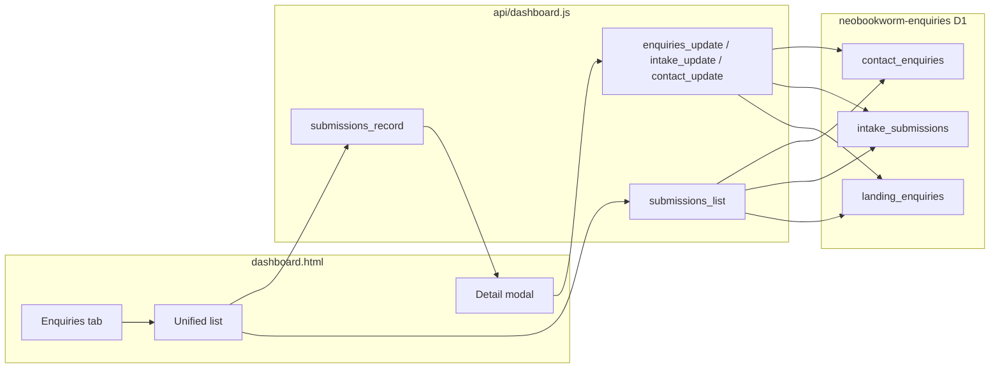

# Combine Enquiries, Intake, and Contact tabs

## Goal

Replace three separate tabs with one **Enquiries** tab that shows all inbound records in one place, sorted by date, with a clear visual label for where each row came from. **No data migration** — records stay in `landing_enquiries`, `intake_submissions`, and `contact_enquiries` in the existing enquiries D1 database ([`api/dashboard.js`](api/dashboard.js)).

## Current state (what we are preserving)

| Source | D1 table | List highlights | Detail-only fields (stay in modal) |
|--------|----------|-----------------|----------------------------------|
| **Enquiry** (landing pages) | `landing_enquiries` | source, start option, Notion/Email delivery | `details`, `current_url`, `payload_json`, sync errors |
| **Intake** (full form) | `intake_submissions` | trade, intake `status` | ~25 fields (photos, logo, services, Notion link, etc.) — see [`renderIntakeHtml`](dashboard.html) |
| **Contact** (`contact.html`) | `contact_enquiries` | trade, message | `message`, admin notes |

Each type already has full CRUD via separate API actions (`enquiries_*`, `intake_*`, `contact_*`). **Detail modals** ([`renderEnquiryHtml`](dashboard.html), [`renderIntakeHtml`](dashboard.html), [`renderContactHtml`](dashboard.html)) must be reused as-is so nothing is dropped from the UI.

**Identity:** Use composite key `{ source_type, source_id }` where `source_type` is `enquiry` | `intake` | `contact` and `source_id` is the existing row `id` (UUIDs are not guaranteed unique across tables).



## Recommended UX

### 1. Single tab: **Enquiries**

- Remove **Intake** and **Contact** from the header nav in [`dashboard.html`](dashboard.html) (lines ~729–731).
- Keep tab `data-tab="enquiries"` (per your preference); internally treat it as the unified inbound view.

### 2. Optional overview row (mirrors Prospects)

Above the table, show three small count cards (or pills):

- **Landing enquiry** — count + unhandled from `landing_enquiries`
- **Intake form** — count + unhandled from `intake_submissions`
- **Contact form** — count + unhandled from `contact_enquiries`

Clicking a card applies the **Source** filter below (same pattern as Prospects status cards). Clicking the tab title / breadcrumb resets to “all sources” (reuse existing [`goToTabRoot`](dashboard.html) pattern).

### 3. Unified list controls

Shared controls (one state object instead of `enqPage` / `intakePage` / `contactPage`):

- **Handled:** All / Unhandled / Handled (unchanged behaviour)
- **Source:** All | Enquiry | Intake | Contact (new)
- **Search:** one box; search normalized fields (name, business, email, trade where present)
- **Debounce:** reuse `FILTER_DEBOUNCE_MS` (700ms) + soft refresh so typing is not interrupted

### 4. Unified table columns

| Column | Content |
|--------|---------|
| Date | `created_at` (all types) |
| **Source** | Colour-coded pill: **Enquiry** (blue), **Intake** (amber), **Contact** (teal) — new CSS classes e.g. `.src-enquiry`, `.src-intake`, `.src-contact` |
| Name | `full_name` or `name` |
| Business | `biz_name` / `business_name` / — |
| Trade | trade field or — |
| Handled | shared pill |
| **Status** | Type-specific summary (not full detail): Enquiry → Notion + Email pills; Intake → `status` pill; Contact → truncated message preview or — |

Row click opens the existing modal via `loadSubmissionRecord(source_type, source_id)` which delegates to current `loadEnquiryRecord` / `loadIntakeRecord` / `loadContactRecord`.

### 5. Tab badge

Replace three separate badges (`updateEnqBadge`, `updateIntakeBadge`, `updateContactBadge`) with **one** unhandled total:

`enqUnhandled + intakeUnhandled + contactUnhandled`

Still populated from existing login `summary` response ([`action=summary`](api/dashboard.js) lines 548–559). After save/delete, adjust the correct sub-counter internally, then refresh the single badge.

## API changes ([`api/dashboard.js`](api/dashboard.js))

### New: `submissions_list`

Query params: `page`, `q`, `handled`, `source` (`all` | `enquiry` | `intake` | `contact`).

Implementation: `UNION ALL` of three normalized selects (same `enquiriesDb()`), then `ORDER BY created_at DESC` + `LIMIT`/`OFFSET`:

```sql
SELECT 'enquiry' AS source_type, id AS source_id, created_at,
       full_name AS display_name, biz_name AS business_name,
       email, NULL AS trade, handled,
       start_option, NULL AS intake_status, NULL AS message_preview,
       notion_status, email_status
FROM landing_enquiries
UNION ALL
SELECT 'intake', id, created_at, full_name, business_name, email,
       trade_category, handled, NULL, status, NULL, NULL, NULL
FROM intake_submissions
UNION ALL
SELECT 'contact', id, created_at, name, NULL, email,
       trade, handled, NULL, NULL, substr(message,1,80), NULL, NULL
FROM contact_enquiries
```

- Apply `handled` and `q` in each branch before union (or wrap union in subquery — prefer subquery for simpler shared filters).
- Count query: `SELECT COUNT(*) FROM ( ... union without limit ... )`.

### New: `submissions_record`

Params: `source_type`, `id` → routes to existing `SELECT *` on the correct table (same as current `*_record` handlers).

### Keep existing write/delete endpoints

No change to `enquiries_update`, `intake_update`, `contact_update`, `*_delete` — the modal wiring already calls these. Optionally add thin `submissions_update` / `submissions_delete` wrappers later; not required for v1.

### Deprecate (frontend only)

Stop calling `enquiries_list`, `intake_list`, `contact_list` from the UI after cutover. Leave handlers in API briefly for safety, or remove in same PR if you prefer a clean break.

## Frontend changes ([`dashboard.html`](dashboard.html))

1. **State:** Replace separate `enqPage` / `intakePage` / `contactPage` (and three search/handled vars) with `submissionsPage`, `submissionsSearch`, `submissionsHandled`, `submissionsSource`.
2. **New functions:** `loadSubmissionsList`, `renderSubmissionsList`, `loadSubmissionRecord` (router).
3. **Remove:** `loadIntakeList`, `loadContactList`, duplicate renderers, Intake/Contact tab buttons, `updateIntakeBadge` / `updateContactBadge` (fold into `updateEnqBadge` or rename `updateSubmissionsBadge`).
4. **`goToTabRoot('enquiries')`:** Reset unified filters; close modal.
5. **Save/delete callbacks:** Refresh unified list; update correct unhandled sub-count.
6. **CSS:** Source pill colours + optional overview card styles consistent with existing navy/amber palette.

## What does not change

- Form submission pipelines (Worker, Vercel intake, `contact.js`) — still write to the same tables.
- All columns in D1; no schema merge.
- Full field display in modals (intake remains the large form view).
- Prospects and Campaigns tabs untouched.

## Testing checklist

- [ ] Unified list shows all three types, newest first.
- [ ] Source filter and handled filter combine correctly.
- [ ] Search finds records in each table.
- [ ] Row click opens correct modal with full fields (especially intake photos / enquiry delivery errors).
- [ ] Edit handled / admin notes / intake status saves to correct table.
- [ ] Delete removes from correct table and updates badge.
- [ ] Tab badge = sum of unhandled across three tables.
- [ ] Click Enquiries tab again from filtered list returns to overview + all sources.

## Effort estimate

~1 focused session: API union list + count (~1–2h), UI merge + source styling (~2–3h), regression pass on three modal types (~30m).
